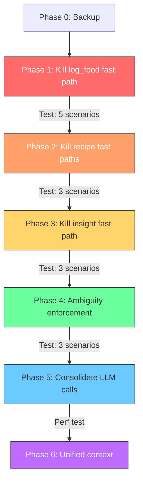

# Critical Issues Fix Plan

**Reference**: [Critical Issues Report](./Critical%20issues%20report.md)
**Goal**: Eliminate fast paths, route all intents through the ReasoningAgent, consolidate LLM calls, and unify context passing.

> [!IMPORTANT]
> This is a **phased plan**. Each phase is independently deployable and testable. Do NOT move to the next phase until the current one is verified.

---

## Phase 0: Pre-Work — Snapshot & Safety Net

**Duration**: ~30 min
**Risk**: None

### Steps

1. **Create a backup of the current orchestrator**
   - Copy `orchestrator_v3.ts` → `orchestrator_v3_backup.ts` (do NOT import it anywhere, just a safety net)

2. **Document the current fast-path intent→handler mapping** (for reference during refactor):

   | Intent | Lines | What it does inline | Should become |
   |--------|-------|---------------------|---------------|
   | `greet` | 354-370 | ChatAgent only | Keep as-is (no tools needed) |
   | `store_memory` | 371-384 | Direct `toolExecutor.storeMemory()` | Keep as-is (simple delegation) |
   | `confirm` | 385-399 | `handlePendingConfirmation()` | Keep as-is (stateful, not AI) |
   | `decline`/`cancel` | 400-410 | Clear pending action | Keep as-is (simple) |
   | `audit`/`patterns`/`reflect`/`classify_day`/`summary` | 411-444 | Direct InsightAgent call | **Route to ReasoningAgent** |
   | `log_food` (single item) | 445-611 | Inline nutrition lookup + recipe search + health check + proposal | **Route to ReasoningAgent** |
   | `log_food` (multi item) | 612-615 | Falls through to ReasoningAgent | Already correct |
   | `log_recipe` | 616-772 | Inline recipe parse/search + proposal | **Route to ReasoningAgent** |
   | `save_recipe` | 773-823 | Inline recipe parse + proposal | **Route to ReasoningAgent** |

3. **Identify what MUST stay as fast paths** (stateful/deterministic, not AI):
   - `greet` → Just ChatAgent, no tools. Keep.
   - `confirm` → `handlePendingConfirmation()` is pure state machine logic. Keep.
   - `cancel`/`decline` → Simple session clear. Keep.
   - `store_memory` → Simple delegation. Keep.

---

## Phase 1: Eliminate the `log_food` Fast Path ⭐ Highest Impact

**Duration**: ~2-3 hours
**Risk**: Medium (this is the most-used code path)
**Fixes**: Whey protein accuracy, safety checks, nutrition verification, memory application

### What changes

The single-item `log_food` fast path (lines 445-611) is the biggest source of bugs. We remove it and let the ReasoningAgent handle ALL food logging via its tool-calling loop.

### Steps

#### 1.1 Enhance the ReasoningAgent's system prompt

**File**: [reasoning-agent.ts](file:///c:/Users/ianku/Desktop/cursor%20projects/Joshs%20Food%20App/supabase/functions/chat-handler/agents/reasoning-agent.ts)

Add explicit instructions for single-item food logging to the `SYSTEM_PROMPT`:

```diff
 1. **Context First:** ALWAYS call 'get_user_goals' and 'get_today_progress' at the START...
 2. **Action Oriented (PCC Pattern):** If intent is LOGGING...
+
+**SINGLE FOOD ITEM LOGGING WORKFLOW (MANDATORY):**
+When the user wants to log a food item, follow this EXACT sequence:
+1. Call 'get_user_goals' and 'get_today_progress' (if not already done)
+2. Call 'ask_nutrition_agent' with query_type 'lookup' for the food item(s)
+3. Review the nutrition data returned:
+   - If health_flags contain 'CRITICAL', WARN the user but don't block
+   - If confidence is 'low', mention the uncertainty in your response
+4. Call 'propose_food_log' with the nutrition data
+5. NEVER skip steps 2-4. NEVER estimate nutrition yourself — always use ask_nutrition_agent.
+
+**HYPOTHETICAL / WHAT-IF QUERIES:**
+If the user says "If I eat..." or "What would happen if...", do NOT call propose_food_log.
+Instead, call ask_nutrition_agent for the data, then REASON about the impact verbally.
```

#### 1.2 Pass intent metadata to the ReasoningAgent

**File**: [orchestrator_v3.ts](file:///c:/Users/ianku/Desktop/cursor%20projects/Joshs%20Food%20App/supabase/functions/chat-handler/orchestrator_v3.ts)

Currently, the ReasoningAgent receives the intent type but not extracted entities (food_items, portions). Update the call at Step 4 (line ~831) to pass these:

```diff
 const reasoningResult = await reasoningAgent.execute({
   message: augmentedMessage,
   intent: {
     type: intentResult.intent,
     confidence: intentResult.confidence,
-    entities: intentResult.entities
+    entities: intentResult.entities,
+    food_items: intentResult.food_items,
+    portions: intentResult.portions,
+    ambiguity_level: intentResult.ambiguity_level,
+    ambiguity_reasons: intentResult.ambiguity_reasons
   },
   chatHistory
 }, context);
```

Also update the ReasoningAgent's `execute()` method to inject these into the user message context:

```diff
 // In reasoning-agent.ts execute():
 const userMessage = input.message;
+const intentMeta = input.intent;
+let contextPrefix = '';
+if (intentMeta?.food_items?.length) {
+  contextPrefix += `[EXTRACTED ENTITIES: ${intentMeta.food_items.join(', ')}]`;
+  if (intentMeta.portions?.length) {
+    contextPrefix += ` [PORTIONS: ${intentMeta.portions.join(', ')}]`;
+  }
+}
+if (intentMeta?.ambiguity_level === 'high' || intentMeta?.ambiguity_level === 'medium') {
+  contextPrefix += ` [AMBIGUITY: ${intentMeta.ambiguity_level} — ${intentMeta.ambiguity_reasons?.join('; ')}]`;
+}
+const finalMessage = contextPrefix ? `${contextPrefix}\n\n${userMessage}` : userMessage;
```

#### 1.3 Remove the `log_food` fast path from the switch statement

**File**: [orchestrator_v3.ts](file:///c:/Users/ianku/Desktop/cursor%20projects/Joshs%20Food%20App/supabase/functions/chat-handler/orchestrator_v3.ts)

Replace the entire `case 'log_food':` / `case 'query_nutrition':` block (lines 445-615) with:

```typescript
case 'log_food':
case 'query_nutrition':
  // Clear stale pending actions for new logs
  if (intent === 'log_food') {
    await sessionService.clearPendingAction(userId);
  }
  // All food logging and nutrition queries are handled by the ReasoningAgent
  // which has access to ask_nutrition_agent (with safety, memory, verification)
  console.log('[OrchestratorV3] Routing log_food/query_nutrition to ReasoningAgent');
  break;
```

This turns `log_food` into a simple fall-through to the ReasoningAgent at Step 4.

#### 1.4 Ensure `ask_nutrition_agent` (ToolExecutor) passes all context

**File**: [tool-executor.ts](file:///c:/Users/ianku/Desktop/cursor%20projects/Joshs%20Food%20App/supabase/functions/chat-handler/services/tool-executor.ts)

Verify `askNutritionAgent()` (lines 135-156) passes health constraints, memories, and tracked nutrients to the NutritionAgent. Currently:

```typescript
async askNutritionAgent(args) {
  // VERIFY these are passed through:
  const result = await this.nutritionAgent.execute({
    items: args.items,
    portions: args.portions || args.items.map(() => '1 serving'),
    trackedNutrients: this.context.trackedNutrients || [],   // ← must be passed
    originalDescription: args.items.join(', ')                // ← must be passed
  }, this.agentContext);  // ← agentContext must include healthConstraints, memories
}
```

Check that `this.agentContext` includes `healthConstraints` and `memories`. If not, add them in the constructor.

### Verification

**Manual test** (requires the app running + Supabase logs):

| # | Test | Expected | Tests Fix For |
|---|------|----------|---------------|
| 1 | "Log 1 scoop whey protein" | Proposes ~20-25g protein, not 0.5g | Nutrition accuracy |
| 2 | "Log 2 boiled eggs and toast" | Proposes ~14-15g protein total | Multi-item + accuracy |
| 3 | "Log a Snickers bar" (with peanut allergy set) | Proposes log WITH peanut warning | Safety checks |
| 4 | "If I eat a burger, will I go over my fat limit?" | Does NOT propose a log; gives analysis | Intent handling |
| 5 | "Log 3 oreos" | Proposes with High confidence | Confidence accuracy |

Check Supabase Edge Function logs for:
- `[ReasoningAgent] Calling tool: ask_nutrition_agent` (confirms it's routing through the agent)
- `[NutritionAgent] Normalized` (confirms normalizeInput is running)
- `[NutritionAgent] Health check` (confirms safety check is running)

---

## Phase 2: Eliminate the `log_recipe` and `save_recipe` Fast Paths

**Duration**: ~1-2 hours
**Risk**: Low-Medium
**Fixes**: Recipe naming bug ("String"), consistent recipe workflow

### Steps

#### 2.1 Update ReasoningAgent prompt with recipe workflow

Add to the system prompt:

```diff
+**RECIPE WORKFLOWS:**
+- If user pastes recipe text, call 'parse_recipe_text' with the text
+- If user asks to log a saved recipe, call 'ask_recipe_agent' with action 'find'
+- If multiple recipes found, list them and ask which one
+- If user asks to save a recipe, call 'parse_recipe_text' then propose saving
+- ALWAYS use the recipe name extracted from the text, never generate a type name
```

#### 2.2 Remove `log_recipe` and `save_recipe` fast paths

Replace lines 616-823 with simple fall-throughs:

```typescript
case 'log_recipe':
case 'save_recipe':
  await sessionService.clearPendingAction(userId);
  console.log(`[OrchestratorV3] Routing ${intent} to ReasoningAgent`);
  break;
```

#### 2.3 Fix the recipe naming bug in `parse_recipe_text`

**File**: [tool-executor.ts](file:///c:/Users/ianku/Desktop/cursor%20projects/Joshs%20Food%20App/supabase/functions/chat-handler/services/tool-executor.ts) → `parseRecipeText()` (lines 759-766)

Investigate and fix the `recipe_name` serialization bug. Check if:
- The parsed recipe name is being passed as an object instead of string
- `String(recipeName)` is producing the literal word "String" for undefined/null values
- The RecipeAgent's parsing prompt isn't extracting the name field

### Verification

| # | Test | Expected |
|---|------|----------|
| 1 | Paste a full recipe and say "Save this recipe" | Correctly named, ingredients listed |
| 2 | "Log 1 serving of [saved recipe name]" | Finds recipe, proposes log with correct nutrition |
| 3 | "What's in my chicken pasta recipe?" | Shows ingredients from saved recipe |

---

## Phase 3: Eliminate the Insight Agent Fast Path

**Duration**: ~30 min
**Risk**: Low
**Fixes**: Consistent context, error handling for date issues

### Steps

#### 3.1 Remove the insight fast path

Replace lines 411-444 with a fall-through:

```typescript
case 'audit':
case 'patterns':
case 'reflect':
case 'classify_day':
case 'summary':
  console.log(`[OrchestratorV3] Routing ${intent} to ReasoningAgent`);
  break;
```

The ReasoningAgent already has `ask_insight_agent` in its tool set.

#### 3.2 Fix the "Invalid time value" error in InsightAgent

**File**: Likely in [db-service.ts](file:///c:/Users/ianku/Desktop/cursor%20projects/Joshs%20Food%20App/supabase/functions/chat-handler/services/db-service.ts) or the InsightAgent itself.

- Wrap all `new Date()` calls in the insight/analysis path with try-catch
- Add timezone-aware date parsing: `new Date().toLocaleDateString('en-CA', { timeZone: timezone })`
- Add a fallback: if any date parsing fails, use UTC current day

### Verification

| # | Test | Expected |
|---|------|----------|
| 1 | "Why is my sugar so high today?" | Gets an analysis, no "Invalid time value" error |
| 2 | "How am I doing this week?" | Returns bullet-point summary |
| 3 | "I'm traveling today" | Classifies day as travel, adjusts expectations |

---

## Phase 4: Strengthen Ambiguity Enforcement

**Duration**: ~1 hour
**Risk**: Low
**Fixes**: "Bowl of pasta" should trigger clarification, not silent guess

### Steps

#### 4.1 Update IntentAgent with better ambiguity examples

**File**: [intent-agent.ts](file:///c:/Users/ianku/Desktop/cursor%20projects/Joshs%20Food%20App/supabase/functions/chat-handler/agents/intent-agent.ts)

Add few-shot examples to the system prompt:

```diff
 AMBIGUITY DETECTION (Use the "Variance Protocol"):
 - **high**: Any request where a reasonable guess could be off by >50%.
+  EXAMPLES of HIGH ambiguity:
+  - "Log a bowl of pasta" → unknown size, type, sauce, protein = HIGH
+  - "Log some chicken" → unknown portion, preparation = HIGH
+  - "I had a sandwich" → unknown bread, filling, toppings = HIGH
+  - "Log lunch" → completely unknown = HIGH
+  EXAMPLES of NOT high ambiguity:
+  - "Log 3 oreos" → standard packaged food = NONE
+  - "Log 2 boiled eggs" → well-defined = LOW
+  - "Log a big mac from mcdonalds" → standard menu item = LOW
```

#### 4.2 Pass ambiguity to ReasoningAgent for enforcement

Already done in Phase 1 step 1.2. The ReasoningAgent prompt update from Phase 1 should include:

```diff
+**AMBIGUITY HANDLING:**
+If the intent metadata includes ambiguity_level 'high':
+- Do NOT call propose_food_log
+- Instead, ask 1-2 specific clarifying questions (size? type? preparation?)
+- Keep questions brief and pointed, not interrogative
```

#### 4.3 Remove the orchestrator's ambiguity downgrade

**File**: [orchestrator_v3.ts](file:///c:/Users/ianku/Desktop/cursor%20projects/Joshs%20Food%20App/supabase/functions/chat-handler/orchestrator_v3.ts)

Lines 305-309 currently downgrade `high` to `medium` if it's a follow-up. Keep the downgrade but also mark it clearly:

```diff
 if (intentResult.ambiguity_level === 'high' && augmentedMessage !== message) {
   console.log('[OrchestratorV3] Post-clarification still HIGH. Proceeding with low confidence.');
   intentResult.ambiguity_level = 'medium';
   intentResult.confidence = 'low';
+  intentResult.post_clarification = true; // Signal that user already answered once
 }
```

### Verification

| # | Test | Expected |
|---|------|----------|
| 1 | "Log a bowl of pasta" | Asks clarifying questions (size? sauce? meat?) |
| 2 | "It was carbonara, restaurant portion" | Proposes with Medium/Low confidence |
| 3 | "Log 3 oreos" | Proposes immediately with High confidence |

---

## Phase 5: Consolidate Micro-LLM Calls (Performance)

**Duration**: ~2-3 hours
**Risk**: Medium (changes NutritionAgent internals)
**Fixes**: Latency, token costs, timeout risk

> [!WARNING]
> Only do this AFTER Phases 1-4 are verified working. This is an optimization, not a bug fix.

### Steps

#### 5.1 Merge `normalizeInput()` into the API lookup path

Instead of a separate LLM call BEFORE looking up nutrition, try the API lookup first with the raw name. Only call `normalizeInput()` if the API returns no results or invalid data.

```
Before: normalizeInput() → API lookup → verify
After:  API lookup → if failed → normalizeInput() → API retry → verify
```

This eliminates one LLM call for all standard foods that match the API directly (e.g., "chicken breast", "apple").

#### 5.2 Make `verifyNutrition()` conditional

Only run the LLM verification if:
- The data came from an LLM estimation (not from API/cache)
- OR the confidence is already 'low'
- OR the item was flagged by `normalizeInput()`

For High-confidence API cache hits, skip verification entirely.

#### 5.3 Remove or populate `NUTRITION_FALLBACKS`

Either:
- **Remove** `findFallbackNutrition()` and the empty `NUTRITION_FALLBACKS` object (dead code cleanup)
- **Or populate** with the top 50 most-logged foods as a performance cache

### Verification

Measure end-to-end response time for "Log 2 eggs" before and after. Target: <5s total (down from current ~8-12s).

---

## Phase 6: Unified Context Object

**Duration**: ~1-2 hours
**Risk**: Low
**Fixes**: Context fragmentation, data loss between agents

### Steps

#### 6.1 Define a `PipelineContext` interface

**File**: New file `supabase/functions/chat-handler/types/pipeline-context.ts`

```typescript
export interface PipelineContext {
  // Identity
  userId: string;
  sessionId: string;
  timezone: string;
  
  // Services
  supabase: any;
  db: DbService;
  
  // User State (loaded once at pipeline start)
  userGoals: Goal[];
  healthConstraints: HealthConstraint[];
  memories: Memory[];
  dayClassification: DayClassification | null;
  trackedNutrients: string[];
  todayProgress: NutrientProgress | null;
  
  // Session State
  session: SessionState;
  pendingAction: PendingAction | null;
  
  // Intent Context (from IntentAgent)
  intent: IntentResult;
}
```

#### 6.2 Build the context once, pass everywhere

In `orchestrateV3()`, build the full `PipelineContext` at the top (line ~60-92), including `todayProgress` (currently only fetched by ReasoningAgent when it calls the tool). Pass this to ALL agents:

```typescript
const pipelineContext: PipelineContext = {
  // ... all fields populated once
  todayProgress: await db.getTodayProgress(userId, timezone),
  // ... etc
};
```

#### 6.3 Update agent signatures to accept `PipelineContext`

Update `ReasoningAgent.execute()`, `ChatAgent.execute()`, `InsightAgent.execute()` to receive the typed `PipelineContext` instead of a loose `context: any`.

### Verification

After this change, grep the codebase for `context.healthConstraints`, `context.memories` etc. and verify they all reference the same unified object. There should be NO separate fetches of goals/constraints/memories outside of the orchestrator's initial load.

---

## Execution Order Summary



**Phase 1 is by far the highest priority** — it fixes 5 of 8 test failures in one change. Phases 2-4 fix the remaining 3. Phases 5-6 are optimizations.

---

## Expected Outcome After All Phases

| Metric | Before | After |
|--------|--------|-------|
| `orchestrator_v3.ts` lines | ~1,340 | ~600 |
| LLM calls per food log | 7-8 | 4-5 |
| Test failures (from report) | 8/8 | 0/8 |
| Fast path intents | 9 | 4 (greet, confirm, cancel, store_memory) |
| Safety check coverage | ~0% (bypassed) | 100% (always via NutritionAgent) |

---

## Risks & Mitigations

| Risk | Mitigation |
|------|-----------|
| ReasoningAgent might not follow the food logging workflow | Phase 1.1 adds explicit step-by-step instructions + we test immediately |
| Increased latency for simple logs | The fast path saved ~1 GPT-4o call. Phase 5 removes 2-3 GPT-4o-mini calls, net neutral |
| ReasoningAgent hallucinating nutrition data | The prompt explicitly says "NEVER estimate yourself — always use ask_nutrition_agent" |
| Breaking the frontend / response format | The response shape (proposal, data, response_type) stays the same — only the routing changes |
| Supabase Edge Function timeouts | Phase 5 reduces total LLM calls, but monitor logs for any calls approaching 60s |
