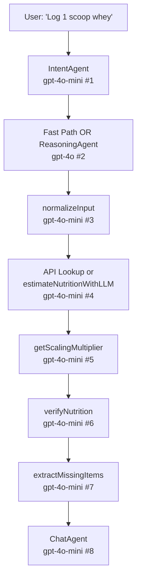
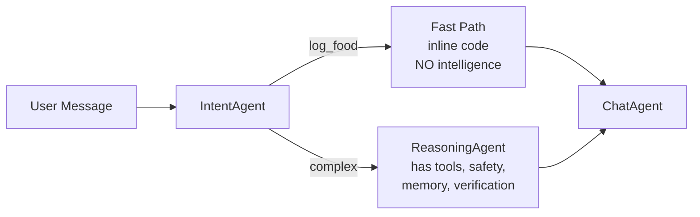
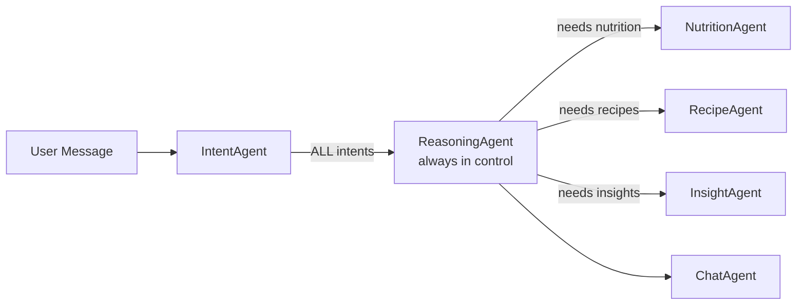

# NutriPal Deep Codebase Analysis

> **TL;DR**: The app's 8 documented test failures all trace back to **one architectural decision**: the orchestrator bypasses the intelligent ReasoningAgent for common intents, using dumb inline code instead. Every fix has been layered on top without addressing this, creating a growing pile of band-aids.

---

## The 3 Architectural Root Causes

### 1. The Fast-Path Anti-Pattern

> [!CAUTION]
> This is the **#1 cause of failures**. The orchestrator handles most intents inline, bypassing the ReasoningAgent entirely.

[orchestrator_v3.ts](file:///c:/Users/ianku/Desktop/cursor%20projects/Joshs%20Food%20App/supabase/functions/chat-handler/orchestrator_v3.ts) is **1,340 lines** with a massive switch statement that creates two completely separate execution paths:

| | **Path A: Fast Path** (inline) | **Path B: ReasoningAgent** (fallback) |
|---|---|---|
| **When used** | Most common intents (`log_food`, `log_recipe`, `greet`, `audit`, etc.) | Only as "fallback" for complex/unrecognized queries |
| **Nutrition lookup** | Raw [lookupNutrition()](file:///c:/Users/ianku/Desktop/cursor%20projects/Joshs%20Food%20App/supabase/functions/chat-handler/services/tool-executor.ts#421-523) API call | `ask_nutrition_agent` → full pipeline |
| **Safety checks** | Reads `health_flags`… that were never populated | `NutritionAgent.checkHealthConstraints()` works |
| **AI verification** | None | [normalizeInput()](file:///c:/Users/ianku/Desktop/cursor%20projects/Joshs%20Food%20App/supabase/functions/chat-handler/agents/nutrition-agent.ts#723-776) + [verifyNutrition()](file:///c:/Users/ianku/Desktop/cursor%20projects/Joshs%20Food%20App/supabase/functions/chat-handler/agents/nutrition-agent.ts#777-859) |
| **Memory application** | None | [applyMemories()](file:///c:/Users/ianku/Desktop/cursor%20projects/Joshs%20Food%20App/supabase/functions/chat-handler/agents/nutrition-agent.ts#488-570) via NutritionAgent |
| **Context loading** | Doesn't call `get_user_goals` first | Prompt says "ALWAYS call goals first" |

**The architecture doc says the ReasoningAgent is "the brain"** — but in practice, the brain is bypassed for the most common operations. The fast path was meant as a performance optimization, but it cuts out all the intelligence.

#### How this caused test failures

| Test Failure | Why it failed |
|---|---|
| Whey protein = 0.5g protein | Fast path called raw API → matched "liquid sweet whey" (a dairy byproduct). ReasoningAgent path would have used [normalizeInput()](file:///c:/Users/ianku/Desktop/cursor%20projects/Joshs%20Food%20App/supabase/functions/chat-handler/agents/nutrition-agent.ts#723-776) → "Whey Protein Powder Isolate" |
| Eggs = 4g protein | Fast path scaling bug. ReasoningAgent path would have used [verifyNutrition()](file:///c:/Users/ianku/Desktop/cursor%20projects/Joshs%20Food%20App/supabase/functions/chat-handler/agents/nutrition-agent.ts#777-859) to catch this |
| Safety checks ignored (Snickers + peanut allergy) | Fast path reads `health_flags` from nutrition data, but the raw API never adds them. Only `NutritionAgent.execute()` calls [checkHealthConstraints()](file:///c:/Users/ianku/Desktop/cursor%20projects/Joshs%20Food%20App/supabase/functions/chat-handler/agents/nutrition-agent.ts#457-487) |
| "If I eat a burger" → logged as food | Fast path for `log_food` intent runs before anyone checks if it's hypothetical. ReasoningAgent prompt says "don't log hypotheticals" |
| Oreos = medium confidence | Fast path doesn't have AI confidence reasoning. Just labels everything medium |

---

### 2. The Micro-Brain Explosion

> [!WARNING]
> A **single food log** can trigger up to **7-8 separate LLM calls**, each in isolation, none sharing context.

The NutritionAgent alone makes up to 5 LLM calls per food item:



Each of these mini-LLM calls was added in a separate conversation to fix a specific bug:
- [normalizeInput()](file:///c:/Users/ianku/Desktop/cursor%20projects/Joshs%20Food%20App/supabase/functions/chat-handler/agents/nutrition-agent.ts#723-776) → Feb 13 fix for "whey" → "whey protein powder"
- [verifyNutrition()](file:///c:/Users/ianku/Desktop/cursor%20projects/Joshs%20Food%20App/supabase/functions/chat-handler/agents/nutrition-agent.ts#777-859) → Feb 13 fix for sanity checking nutrition values
- [extractMissingItems()](file:///c:/Users/ianku/Desktop/cursor%20projects/Joshs%20Food%20App/supabase/functions/chat-handler/agents/nutrition-agent.ts#860-904) → Feb 16 fix for "protein with water" not logging water
- [applyMemories()](file:///c:/Users/ianku/Desktop/cursor%20projects/Joshs%20Food%20App/supabase/functions/chat-handler/agents/nutrition-agent.ts#488-570) slow path → Feb 11 fix for typo handling in memory matching

**The problem**: These micro-brains don't share context. [normalizeInput()](file:///c:/Users/ianku/Desktop/cursor%20projects/Joshs%20Food%20App/supabase/functions/chat-handler/agents/nutrition-agent.ts#723-776) doesn't know the user's goals. [verifyNutrition()](file:///c:/Users/ianku/Desktop/cursor%20projects/Joshs%20Food%20App/supabase/functions/chat-handler/agents/nutrition-agent.ts#777-859) doesn't know if the user already confirmed the data. [extractMissingItems()](file:///c:/Users/ianku/Desktop/cursor%20projects/Joshs%20Food%20App/supabase/functions/chat-handler/agents/nutrition-agent.ts#860-904) might extract items the user didn't intend to log.

**The cost**: On Supabase Edge Functions (60s timeout), 7-8 sequential LLM calls at 500ms-2s each risks timeouts. Token costs multiply.

---

### 3. Context Fragmentation

> [!IMPORTANT]
> Critical information is loaded in one place but needed in another, and gets lost in transit.

| Context | Where loaded | Where needed | Currently passed? |
|---|---|---|---|
| User goals | `get_user_goals` tool | IntentAgent (for ambiguity), NutritionAgent (for tracking), ChatAgent (for formatting) | ❌ Only in ReasoningAgent path |
| Health constraints | [manageHealthConstraints](file:///c:/Users/ianku/Desktop/cursor%20projects/Joshs%20Food%20App/supabase/functions/chat-handler/services/tool-executor.ts#249-279) | Nutrition lookup (for flagging), ChatAgent (for warnings) | ⚠️ Only when full NutritionAgent called |
| Ambiguity level | IntentAgent | ReasoningAgent (should stop if high), ChatAgent (should show confidence) | ⚠️ Stored but not enforced |
| Day classification | InsightAgent | NutritionAgent (relax precision), ChatAgent (adjust tone) | ❌ Not passed through |
| Memories | Loaded from DB | NutritionAgent (for portions), ChatAgent (for personalization) | ⚠️ Sometimes passed, sometimes not |
| Session buffer | Session service | IntentAgent (for follow-ups), all agents | ⚠️ Comma-separated string, fragile |

The [decorateWithContext()](file:///c:/Users/ianku/Desktop/cursor%20projects/Joshs%20Food%20App/supabase/functions/chat-handler/orchestrator_v3.ts#33-54) function prepends recipe context by **string concatenation** to the user's message — this is extremely brittle and will break with any format change.

---

## Secondary Issues

### 4. Ambiguity Detection Is Toothless

The IntentAgent's Variance Protocol detects ambiguity levels, but:
1. **Threshold too high**: "Bowl of pasta" isn't labeled `high` ambiguity — the few-shot examples don't cover common vague inputs
2. **One-shot clarification**: If clarification follow-up is still `high` ambiguity, the orchestrator **downgrades** to `medium` and proceeds anyway
3. **No enforcement**: Even when `high` is detected, the fast path can still call [lookupNutrition()](file:///c:/Users/ianku/Desktop/cursor%20projects/Joshs%20Food%20App/supabase/functions/chat-handler/services/tool-executor.ts#421-523) and propose a log
4. **Contradicts spec**: The [features doc](file:///c:/Users/ianku/Desktop/cursor%20projects/Joshs%20Food%20App/docs/Key%20fetures%20and%20behavior/Features%20and%20behavior.md) says "No silent guessing" — but this is exactly what happens

### 5. Empty Fallback Data

[nutrition-agent.ts#L6](file:///c:/Users/ianku/Desktop/cursor%20projects/Joshs%20Food%20App/supabase/functions/chat-handler/agents/nutrition-agent.ts#L6):
```typescript
const NUTRITION_FALLBACKS = {};  // Empty object!
```

The entire [findFallbackNutrition()](file:///c:/Users/ianku/Desktop/cursor%20projects/Joshs%20Food%20App/supabase/functions/chat-handler/agents/nutrition-agent.ts#58-100) function (lines 60-98) with its modifier stripping, partial matching, and word-level matching is dead code — the fallback table was never populated.

### 6. Recipe Naming Bug

From [test results](file:///c:/Users/ianku/Desktop/cursor%20projects/Joshs%20Food%20App/docs/Testing/post%20test%20issues%20fix.md#L75): recipe is named "String" instead of the actual name. This is likely a `JSON.stringify()` or type coercion bug where the recipe name variable is being serialized to its type name rather than its value.

### 7. Date/Time Error in InsightAgent

"Why is my sugar so high?" → `Error: Invalid time value`. A timestamp parsing error when aggregating today's logs. Likely an edge case in timezone conversion (the Feb 10 conversation history shows timezone fixes were attempted but may not cover all cases).

---

## The Meta-Problem: Feature Velocity Without Consolidation

The conversation history shows **15+ feature/fix conversations in 6 days**:

```
Feb 10: Timezone, recipes, goals setup
Feb 11: Schema audit, memory fixes, model docs
Feb 12: Health constraints, what-if, nutrient hierarchy, tests
Feb 13: Nutrition accuracy, safety checks, intent classification
Feb 16: Nutrition logic refinement
```

Each conversation added new code paths and LLM calls **without removing old ones**. The codebase is accumulating complexity at an unsustainable rate. Comments like `// FIX:`, `// CRITICAL FIX:`, `// HACK:` throughout the orchestrator confirm this pattern.

---

## Recommended Strategic Fix

> [!TIP]
> The single highest-impact change: **eliminate fast paths and route ALL intents through the ReasoningAgent.**

### Before (current)


### After (recommended)


This would:
1. **Fix all safety check failures** — ReasoningAgent always calls health checks
2. **Fix nutrition accuracy** — ReasoningAgent uses proper tools with AI verification
3. **Fix ambiguity handling** — ReasoningAgent can decide to ask clarifying questions
4. **Reduce code by ~400 lines** — Remove the massive inline switch statement
5. **Make the architecture match the docs** — The ReasoningAgent actually becomes "the brain"

The cost is slightly more latency for simple operations (an extra GPT-4o call), but given the system already makes 5-7 LLM calls per operation, the marginal cost is small compared to the reliability gain.

### Additional Consolidation Steps
- **Merge micro-LLM calls**: Let the ReasoningAgent (GPT-4o) handle normalization and verification in its reasoning loop instead of separate GPT-4o-mini calls
- **Build a unified context object**: One data structure that flows through the entire pipeline, carrying goals, constraints, memories, ambiguity level, and day classification
- **Add integration tests**: Before adding Feature 11, ensure Features 1-10 actually work together
- **Populate or remove `NUTRITION_FALLBACKS`**: The empty fallback table makes the entire fallback matching code dead weight
