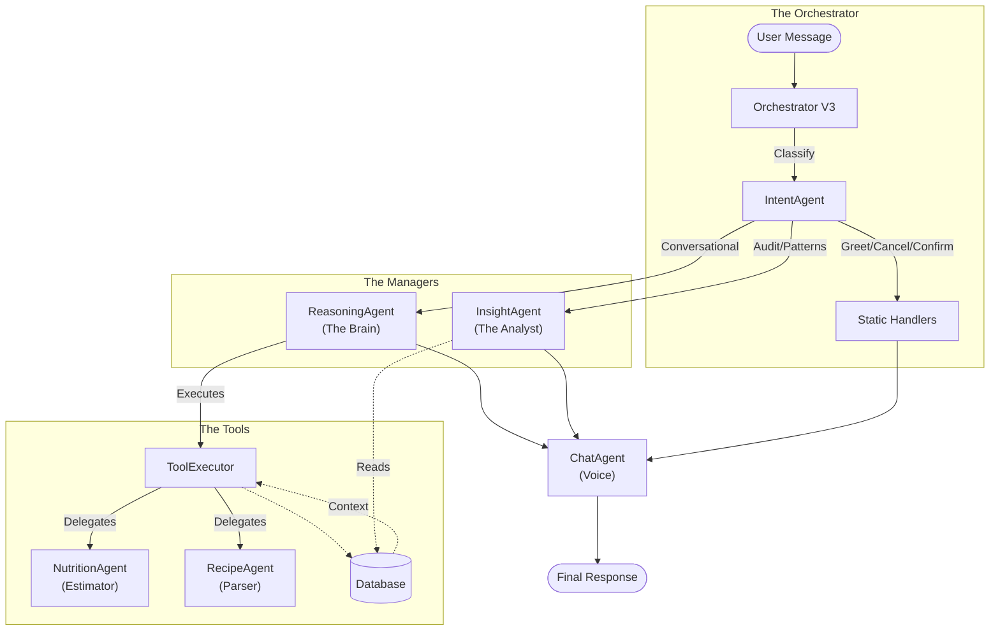

# NutriPal: Agentic Architecture (v3.1)

## Executive Summary

NutriPal is a **reasoning-first nutrition assistant**. Unlike previous versions that relied on deterministic "fast paths", v3.1 routes almost all user intents through a central **Reasoning Agent** (GPT-4o). This ensures every interaction benefits from context awareness, safety checks, and multi-step planning, at the cost of slightly higher latency.

- **Central Brain**: `ReasoningAgent` (GPT-4o) orchestrates tools and sub-agents.
- **Specialists**: Dedicated agents for Nutrition (Estimation), Recipes (Parsing), and Insights (Analysis).
- **Unified Context**: Goals, health constraints, and user memories are passed through the entire pipeline.
- **PCC Pattern**: "Propose-Confirm-Commit" ensures high-stakes actions (logging, saving) require user approval.

---

## Architecture Overview



---

## Core Agent Pipeline

### 1. Orchestrator (`orchestrator_v3.ts`)
The simplified router.
- **Static Checks**: Handles "Thanks", "Confirm", "Cancel" immediately.
- **Intent Classification**: Calls `IntentAgent` to understand the user.
- **Routing**:
    - **Insight Intents** (`audit`, `patterns`, `summary`) → Direct to `InsightAgent`.
    - **Conversational/Action Intents** (`log_food`, `log_recipe`, `query`, `plan`) → **ReasoningAgent**.
- **Context Loading**: Pre-loads user goals, profile, and day classification into a unified `PipelineContext`.

### 2. ReasoningAgent (The Brain)
**Model**: `gpt-4o`
**Role**: Managing the conversation and deciding what tools to use.
- **Context-First**: Always checks user goals and today's progress before answering.
- **Parallel Execution**: Can call `get_today_progress`, `get_user_goals`, and `ask_nutrition_agent` simultaneously.
- **Delegation**: Does NOT estimate nutrition itself. Delegates to `ask_nutrition_agent`.
- **Safety**: Checks for health flags (allergies) in tool outputs and warns the user.
- **PCC**: Logic to "Propose" a log, waiting for user confirmation.

### 3. NutritionAgent (The Estimator)
**Model**: `gpt-4o` (Unified Analysis)
**Role**: The source of truth for food data.
- **Unified Analysis**: Single call to normalize names, estimate nutrition, and check safety.
- **Scaling**: Handles diverse units (cups, grams, "bowls").
- **Fallback**: Tries Database/API first, then falls back to AI estimation.
- **Output**: Returns structured data with `confidence` levels and `health_flags`.

### 4. IntentAgent (The Classifier)
**Model**: `gpt-4o-mini`
**Role**: Rapidly categorizing the user's request.
- **Ambiguity Detection**: Flags vague requests (e.g. "log pasta") as `high` or `medium` ambiguity.
- **Scenario Detection**: Distinguishes "Log a burger" (action) from "If I eat a burger..." (planning).

### 5. ChatAgent (The Voice)
**Model**: `gpt-4o-mini`
**Role**: Formatting the final response.
- **Personality**: Friendly, encouraging, non-judgmental.
- **Formatting**: Converts raw JSON data into readable lists or summaries.
- **Guidance**: Adds specific coaching tips based on the user's progress.

---

## Key Flows

### 1. Food Logging (The "Slow but Smart" Path)
1. **User**: "Log a chicken sandwich."
2. **Orchestrator**: Loads context (Goals, Restrictions). Calls `IntentAgent` → `log_food`.
3. **ReasoningAgent**:
    - Calls `ask_nutrition_agent("chicken sandwich")`.
    - Calls `get_today_progress()`.
4. **NutritionAgent**:
    - DB Lookup: Miss.
    - AI Analysis (GPT-4o): Estimates ~450kcal, Check allergies.
    - Returns data with `medium` confidence.
5. **ReasoningAgent**:
    - Sees data. Checks confidence.
    - Calls `propose_food_log()`.
6. **ChatAgent**: "I've estimated a chicken sandwich at 450 calories. Does that look right?"

### 2. What-If Scenarios
1. **User**: "What if I eat a pizza?"
2. **Orchestrator**: `IntentAgent` → `plan_scenario`.
3. **ReasoningAgent**:
    - Calls `ask_nutrition_agent("pizza")`.
    - Calls `get_today_progress()`.
    - **Crucial**: Does NOT call `propose_food_log`.
    - Reasons: "If you eat this pizza (800 cal), you will exceed your calorie goal by 200."
4. **ChatAgent**: Formats the warning/advice.

### 3. Insights & Audits
1. **User**: "Why is my protein low?"
2. **Orchestrator**: `IntentAgent` → `audit`.
3. **InsightAgent**:
    - Analyzes logs vs goals.
    - Identifies patterns (e.g. "Skipped breakfast").
4. **ChatAgent**: Delivers the analysis.

---

## Data Models

### PipelineContext
A unified object passed to all agents:
```typescript
interface PipelineContext {
  userId: string;
  userGoals: Goal[];
  healthConstraints: Constraint[];
  memories: Memory[];
  dayClassification: string; // "travel", "sick", "normal"
  todayProgress: Progress;
  // ...
}
```

### NutritionResult
Output from NutritionAgent:
```typescript
interface NutritionResult {
    food_name: string;
    calories: number;
    macros: { protein: number, carbs: number, fat: number };
    confidence: "high" | "medium" | "low";
    health_flags: string[]; // e.g. ["Contains Peanuts"]
}
```

---

## Current Performance Characteristics

- **Intelligence**: High. Able to handle complex queries, vague items via estimation, and context-aware safety checks.
- **Latency**: High (~5-10s). Due to sequential GPT-4o calls (Reasoning -> Nutrition).
- **Reliability**: Improved. Safety checks and goal context are consistently applied (no fast-path bypass).
